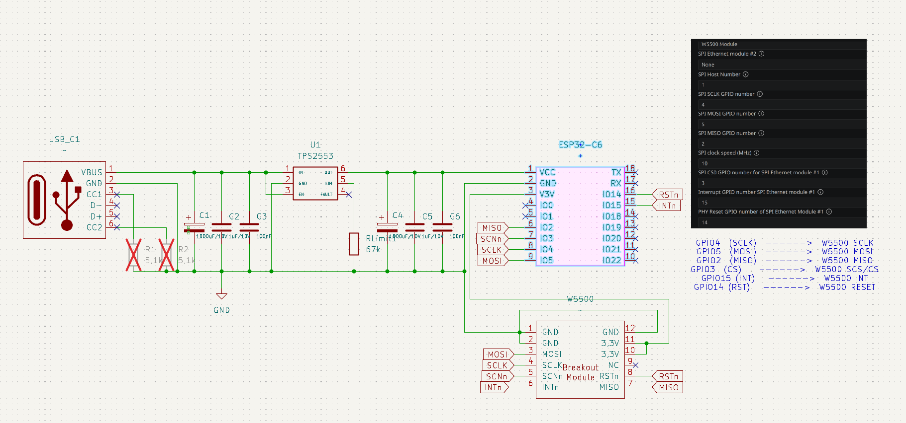

# esp32-wifi-eth-gateway
Proof-of-concept Wifi ⇄ Ethernet gateway running on an ESP32-C6.

## Hardware
- Waveshare ESP32-C6-Zero (or compatible ESP32-C6)
- WIZnet W5500 SPI Ethernet module (or compatible SPI Ethernet adapter)

## Project summary
This project implements a network gateway that forwards traffic between the ESP32's Wi‑Fi interface and a SPI‑based Ethernet interface. It can be used to bridge devices on an Ethernet subnet onto a Wi‑Fi network (or vice versa) for testing, prototyping, and embedded networking research. The implementation uses ESP-IDF networking components and the W5500 driver included as a component.

## Features
- Bridge packets between Wi‑Fi and Ethernet interfaces
- Uses ESP‑IDF networking stack
- Configurable via `menuconfig` / `sdkconfig`
- Example application code in `main/` (`main.c`, `proxy.c`)
- Wifi runs as DHCP client
- Ethernet run as DHCP Server

## Repository layout
- `main/` — application source and component Kconfig
- `partition_table/`, `sdkconfig*` — project configuration
- `managed_components/` — included external components (W5500, ethernet init, etc.)
- `build/` — build output (ignored by source control)
- `circuit-design` KiCad 9 project

## Requirements
- ESP-IDF (supported version: refer to the `esp-idf/` subfolder or `CMakeLists.txt`)
- A toolchain for the target (e.g. for ESP32‑C6)
- `idf.py` (part of ESP‑IDF)

## Quick build & flash
1. Set up ESP‑IDF and toolchain, then source the environment (example):

```bash
. $HOME/esp/esp-idf/export.sh
```

2. (Optional) set the target if needed:

```bash
idf.py set-target esp32c6
```

3. Configure project options (wifi credentials, ethernet pins, etc.):

```bash
idf.py menuconfig
```

4. Build, flash and monitor:

```bash
idf.py build
idf.py -p /dev/ttyUSB0 flash monitor
```

Replace `/dev/ttyUSB0` with your serial device.

## Configuration notes
- Wi‑Fi credentials and runtime options can be set in `menuconfig` or stored in `sdkconfig`/`sdkconfig.defaults` depending on how the project exposes them.
- Hardware pin mappings for the SPI Ethernet module are configured in `menuconfig` or in the ethernet component source — check `managed_components/espressif__w5500/` for driver-specific settings.

## Wiring (ESP32 → W5500)
Below are the SPI pin assignments used in this project.

- SCLK: GPIO4  (`CONFIG_ETHERNET_SPI_SCLK_GPIO=4`)
- MOSI: GPIO5  (`CONFIG_ETHERNET_SPI_MOSI_GPIO=5`)
- MISO: GPIO2  (`CONFIG_ETHERNET_SPI_MISO_GPIO=2`)
- CS (CS0): GPIO3  (`CONFIG_ETHERNET_SPI_CS0_GPIO=3`)
- INT: GPIO15  (`CONFIG_ETHERNET_SPI_INT0_GPIO=15`)
- PHY_RST: GPIO14  (`CONFIG_ETHERNET_SPI_PHY_RST0_GPIO=14`)

ASCII wiring diagram (ESP32 pins -> W5500 pins):

```
ESP32 GPIO4  (SCLK)  ------>  W5500 SCLK
ESP32 GPIO5  (MOSI)  ------>  W5500 MOSI
ESP32 GPIO2  (MISO)  ------>  W5500 MISO
ESP32 GPIO3  (CS)    ------>  W5500 SCS/CS
ESP32 GPIO15 (INT)   ------>  W5500 INT
ESP32 GPIO14 (RST)   ------>  W5500 RESET
```

**Architecture**

- **Overview:** The ESP32 runs a small application that bridges packets between the Wi‑Fi stack (`esp_wifi` / `lwIP`) and a SPI Ethernet controller (W5500). The user-space TCP proxy (`proxy.c`) accepts connections on the ESP32 and forwards bytes between the two interfaces.

- **Responsibilities:**
	- `main.c` — initialises Wi‑Fi, Ethernet and starts the proxy.
	- `proxy.c` — accepts TCP connections and forwards traffic between endpoints.
	- `status_led.c` — indicates general on status and traffic activity (Ethernet/Wi‑Fi).

ASCII architecture diagram:

```
										+----------------------+
										|    Wi‑Fi Network     |
										+----------+-----------+
															 |
												 (802.11 / IP)
															 |
										+----------v-----------+
										|      ESP32‑C6        |
										|  - esp_wifi (STA)    |
										|  - esp_eth (W5500)   |
										|  - proxy.c (TCP fwd) |
										|  - status_led (LED)  |
										+----+-----------+------+
												 |           |
							SPI (MOSI/SCLK/CS)     |  Local IP sockets
												 |           |
										+----v----+      |
										|  W5500   |      |
										| Ethernet |<-----+
										|  PHY     |  (Ethernet network / device)
										+---------+
```

Note: If you change these pins via `menuconfig`, update `sdkconfig` and re-flash the firmware so the driver uses the new assignments.


## Circuit Design
I create a KiCad 9 project with some custom footprints for the following components I used `circuit-design`:
* Waveshare ESP32-C6-Zero with headers
* TPS2553 USB eFuse on DIP-6 Adapter (Powerlimit 400mA)
* Wiznet 5500 module with headers
* generic USB-C Header which included termination resistors



## License & contributors
See the `LICENSE` file for license details. Contributions and issues are welcome.
